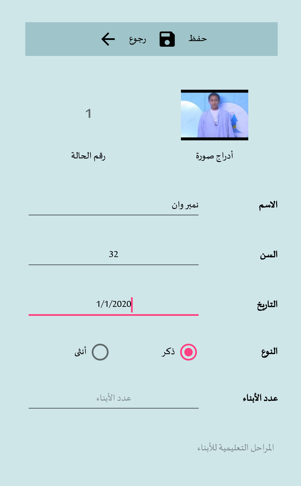
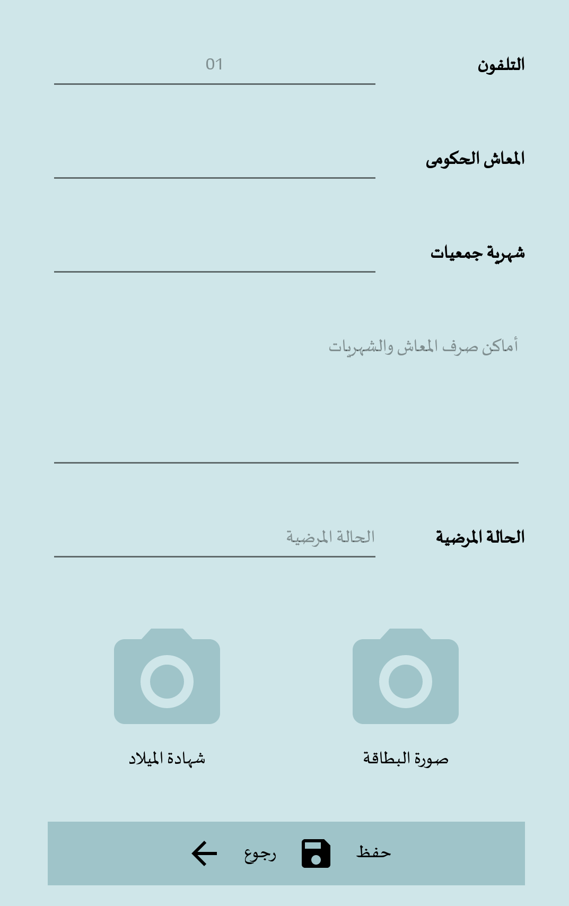
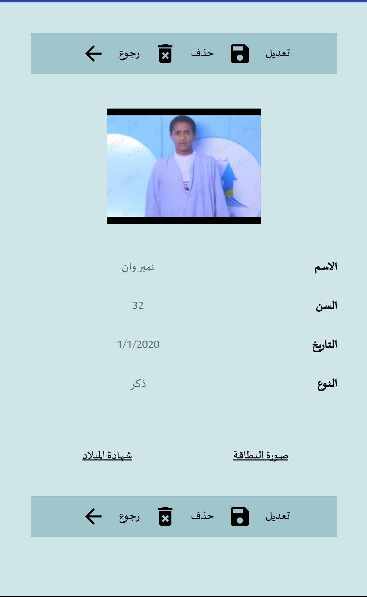

    
  </a>
  
# تطبيق الجمعيات الخيرية
لإدارة بيانات المنتفعين من الجمعيات الخيرية

 

  
  
  

 

  
  
  

 
[Download](https://github.com/Ma7moud3ly/charities/blob/master/app/release/app-release.apk)

